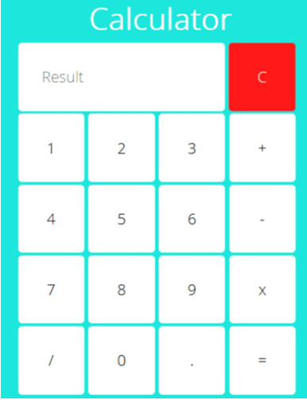

# Day 03 - Frontend Boot Camp

**Задание 1.**  
Тебе необходимо сверстать калькулятор, используя модуль CSS Grid Layout. Ты должен получить следующий результат:  

**Задание 2.**  
Отлично, у тебя есть HTML-форма твоего калькулятора! Теперь тебе надо реализовать функционал его работы. Напиши скрипт, который реализует все представленные в макете операции (сложение/вычитание/умножение/деление/стереть все).

### Bootstrap

CSS-фреймворк — фреймворк, созданный для упрощения работы верстальщика, быстроты разработки и исключения максимально возможного числа ошибок вёрстки (проблемы совместимости различных версий браузеров и т. д.). Данные фреймворки подразумевают использование различных подходов для корректного отображения сайтов на устройствах любого размера.  
Многие разработчики предпочитают использование CSS-фреймворков, вместо прописывания всех стилей вручную.  
[Bootstrap](https://getbootstrap.com/docs/5.2/getting-started/introduction/) легко и эффективно масштабирует твой проект с одной базой кода — от телефонов и планшетов до настольных компьютеров.

Попробуй подключить Bootstrap к своей HTML-странице и поэкспериментируй с [примерами](https://getbootstrap.com/docs/5.2/examples/).

**Задание 3.**  
Ты изучил работу с CSS-фреймворком Bootstrap.  
Теперь тебе надо улучшить свою страничку калькулятора.  
Добавь header на странице, где будет 2 ссылки:

- На страницу calculator, где будет твой калькулятор.
- На страницу Student Info.

На странице Student Info должны отображаться твоё фото и информация о тебе:

- ФИО.
- Стаж обучения.
- Возраст.
